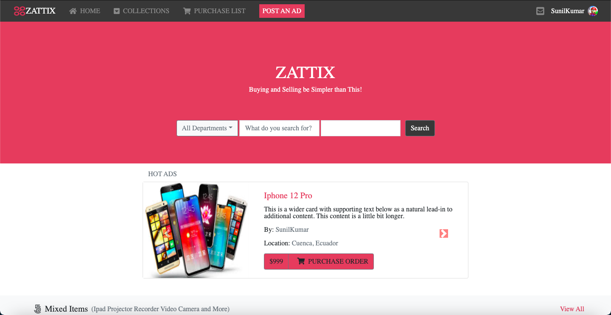
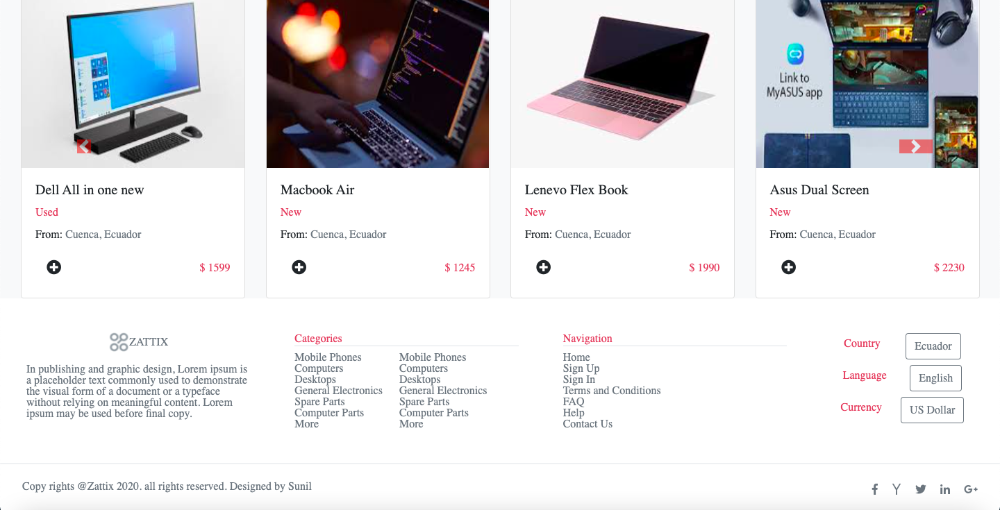
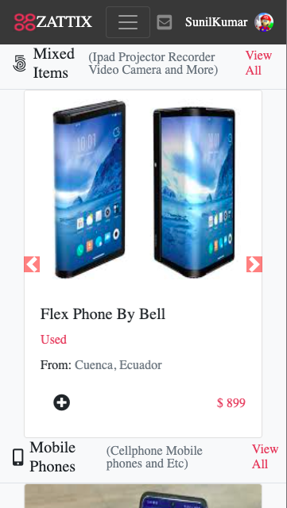
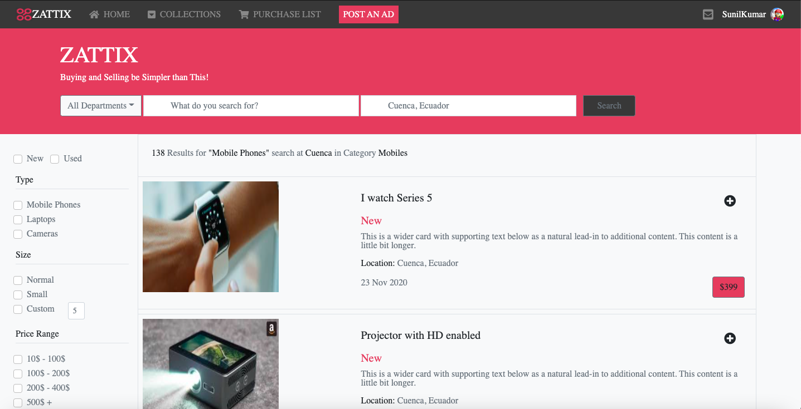
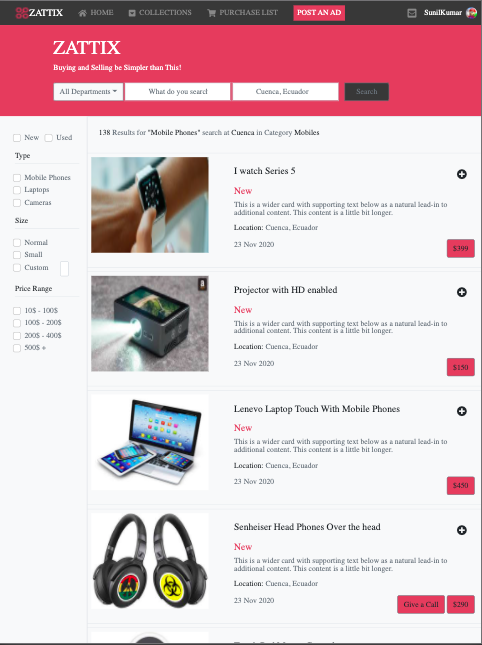
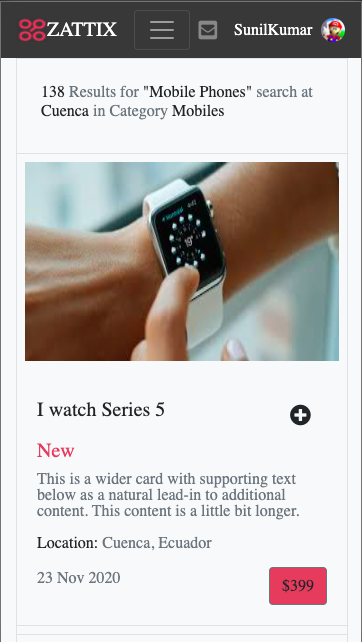

# zattix-electronics

Shop electronics goods through online

# Description

The Capstone Project Aim is to Create an Electronics Shopping site Consist of a Main and Search Page including goods and respective messages along with prices, The page works best in Chrome, It includes HTML CSS and Bootstrap.








## Built With

- HTML
- CSS (flex box, grid)
- Bootstrap

## Live Demo

[Live Demo Link](https://dsunilk.github.io/zattix-electronics/)

## Getting Started

To get a local copy up and running follow these simple example steps.

### Prerequisites

- Live Server plugin for Visual Studio Code

### Setup

1- Clone the repository

```
https://github.com/DsunilK/zattix-electronics.git
```

2- Open the folder on VS Code, right click the index.html file and click on "Open With Live Server"

3- Everything should be running by now.

## Authors

👤 **Sunil Kumar**

- GitHub: [@DsunilK](https://github.com/DsunilK)
- Linkedin: [@DsunilK](https://www.linkedin.com/in/dsunilk/)
- Twiter: [@DsunilK](https://twitter.com/D_sunil_K)

## Video Explanation of Project

[Loom Video Link](https://www.loom.com/share/c63ce145ef164901b0b435bd26b6c77a)

## 🤝 Contributing

Contributions, issues, and feature requests are welcome!

Feel free to check the [issues page]
(https://github.com/DsunilK/zattix-electronics/issues)

## Show your support

Give a ⭐️ if you like this project!

## 📝 License

This project is [MIT](https://github.com/DsunilK/zattix-electronics/blob/main/LICENSE)
